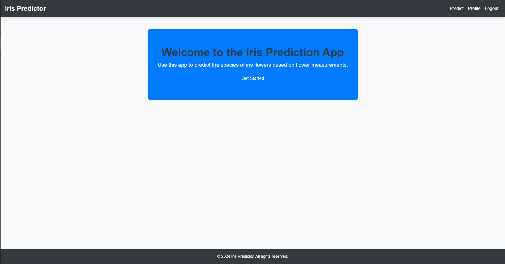
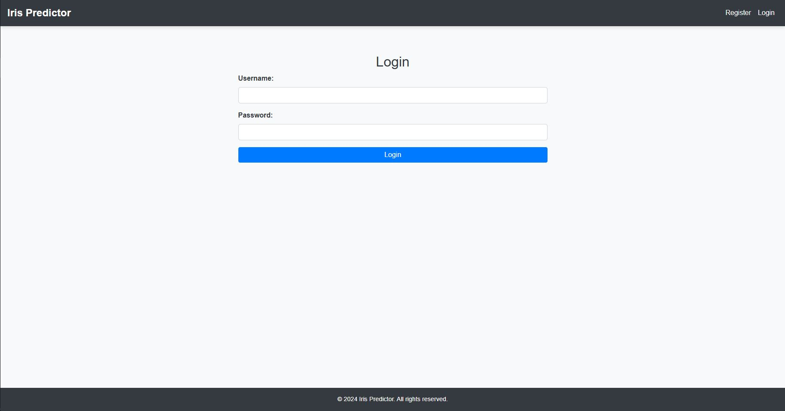
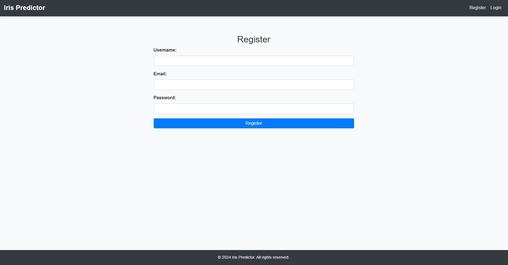
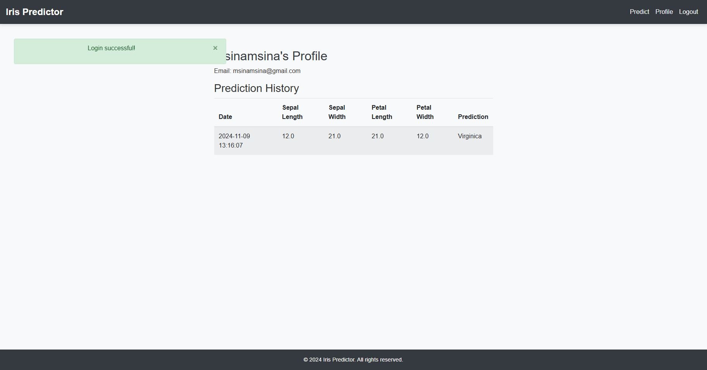
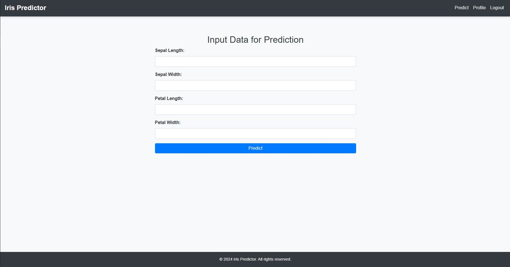
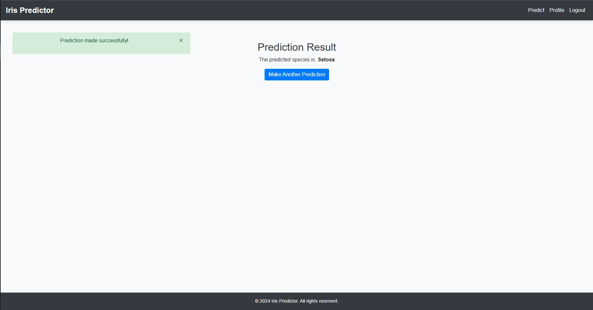

# [Welcome to the Iris Prediction App](https://iris.darkube.app/)

Use this app to predict the species of iris flowers based on flower measurements.


## How to use this app

1. Register your account.
2. login to your account.
3. go to the prediction page.
4. Enter the values for the 4 flower measurements and click on the 'Predict' button to see the predicted iris species.

### Online

You can use the app online by clicking [here](https://iris.darkube.app/).

### Locally
1. Clone the repository
2. Install the required libraries
3. Run the app

```bash
git clone
cd iris-prediction-app
pip install -r requirements.txt
python app.py
```

The app will be running on `http://0.0.0.0:5000/`.

### Docker
1. Clone the repository
2. Build the docker image
3. Run the docker container

```bash
git clone
cd iris-prediction-app
docker build -t iris-prediction-app:latest .
docker run -p 80:5000 iris-prediction-app:latest
```

The app will be running on `http://localhost/`.


## About the model

The model used in this app is a random forest classifier trained on the Iris dataset.
The dataset consists of 150 samples of iris flowers, each with 4 features: 

- sepal length
- sepal width
- petal length
- petal width.

The model achieved an accuracy of 100% on the test set.

## Screenshots

### Home Page (/)

### Login Page (/login)

### Register Page (/register)

### Profile Page (/profile)

### Prediction Page (/predict)

### Results Page (/results)

